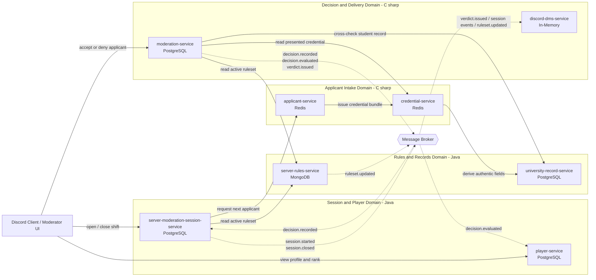

# cpr-pad-team-19

Common Public Repository (CPR) for Team 19 — **Topic 3: Student ID, Please** (FAF.PAD21.1, Autumn 2026).

A distributed system of 8 microservices powering a cooperative verification and moderation platform set within a university Discord server, where student credentials, academic records, and dynamic access rules are evaluated by moderator teams in real time.

## Team Definition & Microservice Allocation

The team works in **2 languages**, split by member pair (4 microservices per pair, 2 microservices per member):

| Member | Assigned Service | Tech Stack | Storage Engine |
| :--- | :--- | :--- | :--- |
| **Daria** | `player-service` `server-moderation-session-service` | Java (Spring Boot) | PostgreSQL |
| **Mihai** | `applicant-service` `credential-service` | C# (.NET 8) | Redis / In-Memory |
| **Diana** | `server-rules-service` `university-record-service` | Java (Spring Boot) | MongoDB / PostgreSQL |
| **Andi** | `moderation-service` `discord-dms-service` | C# (.NET 8) | PostgreSQL / In-Memory |

## Service Boundaries

Every microservice encapsulates a single business capability and owns its own datastore
(Database-per-Service). No service reads or writes another service's database; all data crossing a
boundary travels over an explicit contract — a synchronous REST call or an asynchronous domain
event. Each boundary below states what the service owns, what it deliberately does not own, and the
operations it exposes to the rest of the system.

### 1. `player-service`

Owner: Daria — Java (Spring Boot) — PostgreSQL

- **Encapsulates:** the identity and progression of a moderator (the player). Registration,
  profile, rank, accuracy score, penalty history, and lifetime statistics.
- **Owns:** `player`, `player_stats`, `player_penalty` tables.
- **Does not own:** shift scheduling, decision correctness, or the rules a decision is judged
  against. It only consumes evaluated outcomes and projects them into a score.
- **Exposes:** `GET /players/{id}`, `POST /players`, `GET /players/{id}/stats`,
  `GET /players/{id}/rank`.
- **Consumes:** `decision.evaluated` events to recompute score and rank.

### 2. `server-moderation-session-service`

Owner: Daria — Java (Spring Boot) — PostgreSQL

- **Encapsulates:** the lifecycle of a moderation shift. Opening and closing a session, the queue
  of applicants presented during that shift, per-applicant timers, and the shift summary.
- **Owns:** `session`, `session_queue_entry`, `session_summary` tables.
- **Does not own:** applicant generation, rule content, or verdict evaluation. It orchestrates the
  shift, it does not judge it.
- **Exposes:** `POST /sessions`, `GET /sessions/{id}`, `POST /sessions/{id}/close`,
  `GET /sessions/{id}/next-applicant`.
- **Consumes:** `decision.recorded` events to advance the queue and stop the applicant timer.

### 3. `applicant-service`

Owner: Mihai — C# (.NET 8) — Redis / In-Memory

- **Encapsulates:** generation and short-lived storage of applicant profiles — the people
  requesting entry to the Discord server. Name, faculty, study year, photo reference, and the
  intentional inconsistencies that make an applicant valid or invalid.
- **Owns:** the ephemeral `applicant:{id}` keys, scoped to the lifetime of a session.
- **Does not own:** the documents an applicant presents, nor whether the applicant is ultimately
  legitimate. Ground truth lives in `university-record-service`.
- **Exposes:** `POST /applicants/generate`, `GET /applicants/{id}`.
- **Calls:** `credential-service` to attach a credential bundle to a freshly generated applicant.

### 4. `credential-service`

Owner: Mihai — C# (.NET 8) — Redis / In-Memory

- **Encapsulates:** student ID documents. Issuing a credential bundle for an applicant, computing
  its integrity hash, expiry, and issuing authority, and serving the bundle for inspection.
- **Owns:** the ephemeral `credential:{id}` keys and the document-format definitions.
- **Does not own:** the verdict on a credential. It reports what the document says; it does not
  decide whether the document is acceptable.
- **Exposes:** `POST /credentials/issue`, `GET /credentials/{id}`,
  `POST /credentials/{id}/verify-hash`.
- **Calls:** `university-record-service` to derive authentic field values for legitimate applicants.

### 5. `server-rules-service`

Owner: Diana — Java (Spring Boot) — MongoDB

- **Encapsulates:** the access ruleset in force for a given day or session — required documents,
  accepted faculties, expiry tolerances, blacklists — and the versioning of that ruleset as it
  changes mid-shift.
- **Owns:** the `rulesets` and `rule_revisions` collections. Document storage is chosen because
  rule shapes differ per rule type and evolve between revisions.
- **Does not own:** the evaluation of a specific applicant against the rules. It publishes the
  rules; `moderation-service` applies them.
- **Exposes:** `GET /rulesets/active`, `GET /rulesets/{id}`, `POST /rulesets`,
  `GET /rulesets/{id}/revisions`.
- **Publishes:** `ruleset.updated` events when a revision takes effect.

### 6. `university-record-service`

Owner: Diana — Java (Spring Boot) — PostgreSQL

- **Encapsulates:** the authoritative university registry. Enrolled students, faculty, group,
  study year, enrolment status, and academic standing. This is the system of record against which
  presented credentials are cross-checked.
- **Owns:** `student_record`, `enrolment`, `faculty` tables. Relational storage is chosen for
  referential integrity across enrolments and faculties.
- **Does not own:** anything about gameplay, sessions, or moderators. It is a read-mostly
  reference authority.
- **Exposes:** `GET /records/students/{studentId}`, `POST /records/students/lookup`,
  `GET /records/faculties`.

### 7. `moderation-service`

Owner: Andi — C# (.NET 8) — PostgreSQL

- **Encapsulates:** the decision path. It accepts a moderator's accept or deny call, gathers the
  presented credential, the active ruleset, and the university record, evaluates correctness,
  persists the verdict, and emits the outcome.
- **Owns:** `decision`, `verdict`, `violation` tables — the permanent audit trail of every call
  made during every shift.
- **Does not own:** the score derived from a verdict, the shift queue, or the outbound message.
  It publishes the evaluated outcome and lets the interested services react.
- **Exposes:** `POST /decisions`, `GET /decisions/{id}`, `GET /sessions/{id}/decisions`.
- **Calls:** `credential-service`, `server-rules-service`, `university-record-service`.
- **Publishes:** `decision.recorded`, `decision.evaluated`, `verdict.issued`.

### 8. `discord-dms-service`

Owner: Andi — C# (.NET 8) — In-Memory

- **Encapsulates:** all outbound communication toward Discord. Direct messages to applicants
  carrying their verdict, shift notifications to moderators, rule-change announcements, delivery
  retries, and rate limiting against the Discord API.
- **Owns:** the in-memory outbox and delivery-status cache.
- **Does not own:** any business decision. It is a pure delivery edge and never calls back into
  the domain services.
- **Exposes:** `POST /notifications/dm`, `GET /notifications/{id}/status`.
- **Consumes:** `verdict.issued`, `session.started`, `session.closed`, `ruleset.updated`.

## Technologies & Communication Patterns

The team works in 2 languages, split by repo/member pair. Python was excluded to keep both stacks
statically typed and consistent with the team's existing Spring Boot / .NET expertise, and to
enforce compile-time type safety across the credential/verdict logic where correctness matters
most.

| Repo | Service | Language / Framework | Sync communication | Async communication |
|---|---|---|---|---|
| `player-service` | Player | Java (Spring Boot) | REST CRUD (profile, rank, stats lookup) | Consumes `decision.evaluated` to update score/rank/penalties |
| `server-moderation-session-service` | Session | Java (Spring Boot) | REST to open/close a shift, pull next applicant, assign moderator/junior-mod roles | Publishes `session.started`/`session.closed`; consumes `decision.recorded` to advance the queue |
| `server-rules-service` | Server Rules | Java (Spring Boot) | REST to read active ruleset/revisions | Publishes `ruleset.updated` for services that need to react to mid-shift rule changes |
| `university-record-service` | University Record | Java (Spring Boot) | REST for authoritative student/faculty/enrolment lookups | — (read-mostly system of record; no events published) |
| `applicant-service` | Applicant | C# (.NET 8) | REST to generate/fetch an applicant; calls Credential Service synchronously to attach documents | — |
| `credential-service` | Credential | C# (.NET 8) | REST to issue/fetch/verify a credential; calls University Record Service synchronously to derive authentic fields | — |
| `moderation-service` | Moderation | C# (.NET 8) | REST for the accept/deny call; calls Credential, Rules, and University Record synchronously to gather everything a verdict needs | Publishes `decision.recorded`, `decision.evaluated`, `verdict.issued` for Session/Player/DMs to consume |
| `discord-dms-service` | Discord DMs | C# (.NET 8) | WebSocket for real-time moderator ↔ junior-mod chat channels (`#enrollment-check`, `#faculty-check`, `#general-mod-chat`) | Purely event-driven for outbound notifications: consumes `verdict.issued`, `session.started`/`closed`, `ruleset.updated`; no service calls it synchronously |

**Why this split:**

- **Java (Spring Boot)** for Player, Session, Rules, University Record: these hold the most
  structured, long-lived, relational domain data (player progression, shift/queue state, versioned
  rulesets, the authoritative enrolment registry) and benefit from Spring's mature ecosystem for
  transactional REST APIs, JPA-backed consistency, and strong typing where correctness matters
  most — e.g. no two junior mods ever pulling the same applicant, no stale enrolment data feeding
  a verdict.
- **C# (.NET 8)** for Applicant, Credential, Moderation, Discord DMs: these sit closer to the live
  decision path — applicant/credential generation is short-lived and disposable per shift,
  Moderation is the single most latency-sensitive call in the system (a moderator's accept/deny
  should never feel slow), and Discord DMs is a connection-heavy delivery/chat edge where .NET's
  async I/O and lower per-instance overhead are a good fit.
- **Python was excluded** across both stacks to keep the codebase statically typed end-to-end,
  which matters for a system where a type error in credential or verdict handling would be a
  correctness bug, not just a runtime inconvenience.
- **WebSockets** are used specifically for `discord-dms-service`'s moderator ↔ junior-mod chat,
  since that interaction is inherently real-time and bidirectional — REST elsewhere, since most
  other operations are simple request/response.
- **Async events** are used wherever a service shouldn't block on, or depend on the availability
  of, a downstream consumer — most notably after a verdict is produced in Moderation Service
  (scoring, queue advancement, and Discord delivery all react independently) and for rule changes
  propagating out via `ruleset.updated`.

## Architecture Diagram

Solid arrows are synchronous REST calls in the request path. Dashed arrows are asynchronous domain
events delivered through the message broker.

### Communication Matrix

| Caller | Callee | Style | Purpose |
| :--- | :--- | :--- | :--- |
| `server-moderation-session-service` | `applicant-service` | Sync REST | Pull the next applicant for the shift queue |
| `server-moderation-session-service` | `server-rules-service` | Sync REST | Read the ruleset in force for the session |
| `applicant-service` | `credential-service` | Sync REST | Attach a credential bundle to a generated applicant |
| `credential-service` | `university-record-service` | Sync REST | Derive authentic field values for legitimate applicants |
| `moderation-service` | `credential-service` | Sync REST | Read the credential presented by the applicant |
| `moderation-service` | `server-rules-service` | Sync REST | Read the rules the decision is judged against |
| `moderation-service` | `university-record-service` | Sync REST | Cross-check the applicant against the registry |
| `moderation-service` | `server-moderation-session-service` | Async event | `decision.recorded` advances the shift queue |
| `moderation-service` | `player-service` | Async event | `decision.evaluated` updates score, rank, penalties |
| `moderation-service` | `discord-dms-service` | Async event | `verdict.issued` delivers the DM to the applicant |
| `server-moderation-session-service` | `discord-dms-service` | Async event | `session.started` and `session.closed` notify moderators |
| `server-rules-service` | `discord-dms-service` | Async event | `ruleset.updated` announces a mid-shift rule change |

Synchronous REST is used only where the caller cannot proceed without the answer: the decision path
needs the credential, the rules, and the record before a verdict exists. Everything downstream of a
verdict is asynchronous, so that scoring, queue progression, and Discord delivery cannot slow down
or fail a moderator's decision.

`player-service` and `discord-dms-service` are never called synchronously by another service, and
`discord-dms-service` never calls back into the domain. These two boundaries are deliberately kept
event-driven so that a failure in scoring or in the Discord API cannot block a shift in progress.
