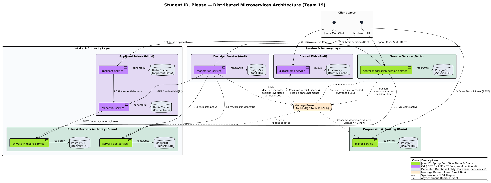

# cpr-pad-team-19

Common Public Repository (CPR) for Team 19 — **Topic 3: Student ID, Please** (FAF.PAD21.1, Autumn 2026).

A distributed system of 8 microservices powering a cooperative verification and moderation platform set within a university Discord server, where student credentials, academic records, and dynamic access rules are evaluated by moderator teams in real time.

## Team Definition & Microservice Allocation

The team works in **2 languages**, split by member pair (4 microservices per pair, 2 microservices per member):

| Member | Assigned Service | Tech Stack | Storage Engine |
| :--- | :--- | :--- | :--- |
| **Daria** | `player-service`<br>`server-moderation-session-service` | Java (Spring Boot) | PostgreSQL |
| **Mihai** | `applicant-service`<br>`credential-service` | C# (.NET 8) | Redis / In-Memory |
| **Diana** | `server-rules-service`<br>`university-record-service` | Java (Spring Boot) | MongoDB / PostgreSQL |
| **Andi** | `moderation-service`<br>`discord-dms-service` | C# (.NET 8) | PostgreSQL / Redis |

## Service Boundaries

Every microservice encapsulates a single business capability and owns its own datastore
(Database-per-Service). No service reads or writes another service's database; all data crossing a
boundary travels over an explicit contract — a synchronous REST call or an asynchronous domain
event. Each boundary below states what the service owns, what it deliberately does not own, and the
operations it exposes to the rest of the system.

### 1. `player-service`

Owner: Daria — Java (Spring Boot) — PostgreSQL

- **Encapsulates:** the identity and progression of a moderator (the player). Registration,
  profile, rank, accuracy score, penalty history, and lifetime statistics.
- **Owns:** `player`, `player_stats`, `player_penalty` tables.
- **Does not own:** shift scheduling, decision correctness, or the rules a decision is judged
  against. It only consumes evaluated outcomes and projects them into a score.
- **Exposes:** `GET /players/{id}`, `POST /players`, `GET /players/{id}/stats`,
  `GET /players/{id}/rank`.
- **Consumes:** `decision.evaluated` events to recompute score and rank.

### 2. `server-moderation-session-service`

Owner: Daria — Java (Spring Boot) — PostgreSQL

- **Encapsulates:** the lifecycle of a moderation shift. Opening and closing a session, the queue
  of applicants presented during that shift, per-applicant timers, and the shift summary.
- **Owns:** `session`, `session_queue_entry`, `session_summary` tables.
- **Does not own:** applicant generation, rule content, or verdict evaluation. It orchestrates the
  shift, it does not judge it.
- **Exposes:** `POST /sessions`, `GET /sessions/{id}`, `POST /sessions/{id}/close`,
  `GET /sessions/{id}/next-applicant`.
- **Consumes:** `decision.recorded` events to advance the queue and stop the applicant timer.

### 3. `applicant-service`

Owner: Mihai — C# (.NET 8) — Redis / In-Memory

- **Encapsulates:** generation and short-lived storage of applicant profiles — the people
  requesting entry to the Discord server. Name, faculty, study year, photo reference, and the
  intentional inconsistencies that make an applicant valid or invalid.
- **Owns:** the ephemeral `applicant:{id}` keys, scoped to the lifetime of a session, and the
  `session:{sessionId}:applicants` index of each session.
- **Does not own:** the documents an applicant presents, nor whether the applicant is ultimately
  legitimate. Ground truth lives in `university-record-service`.
- **Exposes:** `POST /applicants/generate`, `GET /applicants/{id}`, `GET /applicants`,
  `PUT /applicants/{id}`, `DELETE /applicants/{id}`.
- **Calls:** `credential-service` to attach a credential bundle to a freshly generated applicant.

### 4. `credential-service`

Owner: Mihai — C# (.NET 8) — Redis / In-Memory

- **Encapsulates:** student ID documents. Issuing a credential bundle for an applicant, computing
  its integrity hash, expiry, and issuing authority, and serving the bundle for inspection.
- **Owns:** the ephemeral `credential:{id}` keys and the document-format definitions.
- **Does not own:** the verdict on a credential. It reports what the document says; it does not
  decide whether the document is acceptable.
- **Exposes:** `POST /credentials/issue`, `GET /credentials/{id}`,
  `POST /credentials/{id}/verify-hash`, `GET /credentials`, `PUT /credentials/{id}`,
  `DELETE /credentials/{id}`.
- **Calls:** `university-record-service` to derive authentic field values for legitimate applicants.

### 5. `server-rules-service`

Owner: Diana — Java (Spring Boot) — MongoDB

- **Encapsulates:** the access ruleset in force for a given day or session — required documents,
  accepted faculties, expiry tolerances, blacklists — and the versioning of that ruleset as it
  changes mid-shift.
- **Owns:** the `rulesets` and `rule_revisions` collections. Document storage is chosen because
  rule shapes differ per rule type and evolve between revisions.
- **Does not own:** the evaluation of a specific applicant against the rules. It publishes the
  rules; `moderation-service` applies them.
- **Exposes:** `GET /rulesets/active`, `GET /rulesets/{id}`, `POST /rulesets`,
  `GET /rulesets/{id}/revisions`.
- **Publishes:** `ruleset.updated` events when a revision takes effect.

### 6. `university-record-service`

Owner: Diana — Java (Spring Boot) — PostgreSQL

- **Encapsulates:** the authoritative university registry. Enrolled students, faculty, group,
  study year, enrolment status, and academic standing. This is the system of record against which
  presented credentials are cross-checked.
- **Owns:** `student_record`, `enrolment`, `faculty` tables. Relational storage is chosen for
  referential integrity across enrolments and faculties.
- **Does not own:** anything about gameplay, sessions, or moderators. It is a read-mostly
  reference authority.
- **Exposes:** `GET /records/students/{studentId}`, `POST /records/students/lookup`,
  `GET /records/faculties`.

### 7. `moderation-service`

Owner: Andi — C# (.NET 8) — PostgreSQL

- **Encapsulates:** the decision path. It accepts a moderator's accept or deny call, gathers the
  presented credential, the active ruleset, and the university record, evaluates correctness,
  persists the verdict, and emits the outcome.
- **Owns:** `decision`, `verdict`, `violation` tables — the permanent audit trail of every call
  made during every shift.
- **Does not own:** the score derived from a verdict, the shift queue, or the outbound message.
  It publishes the evaluated outcome and lets the interested services react.
- **Exposes:** `POST /decisions`, `GET /decisions/{id}`, `PATCH /decisions/{id}`,
  `DELETE /decisions/{id}`, `GET /sessions/{id}/decisions`.
- **Calls:** `credential-service`, `server-rules-service`, `university-record-service`.
- **Publishes:** `decision.recorded`, `decision.evaluated`, `verdict.issued`, `decision.amended`,
  `decision.voided`.

### 8. `discord-dms-service`

Owner: Andi — C# (.NET 8) — Redis

- **Encapsulates:** all outbound communication toward Discord. Direct messages to applicants
  carrying their verdict, shift notifications to moderators, rule-change announcements, delivery
  retries, and rate limiting against the Discord API.
- **Owns:** the Redis outbox: every notification with its delivery status, the delivery queue, the
  ids of the events already processed, and the moderator of each open shift.
- **Does not own:** any business decision. It is a pure delivery edge and never calls back into
  the domain services.
- **Exposes:** `POST /notifications/dm`, `GET /notifications/{id}/status`, `GET /notifications/{id}`,
  `POST /notifications/{id}/retry`, `DELETE /notifications/{id}`.
- **Consumes:** `verdict.issued`, `session.started`, `session.closed`, `ruleset.updated`.


## Technologies & Communication Patterns

The team works in 2 languages, split by repo/member pair. Python was excluded to keep both stacks
statically typed and consistent with the team's existing Spring Boot / .NET expertise, and to
enforce compile-time type safety across the credential/verdict logic where correctness matters
most.

| Repo | Service | Language / Framework | Sync communication | Async communication |
|---|---|---|---|---|
| `player-service` | Player | Java (Spring Boot) | REST CRUD (profile, rank, stats lookup) | Consumes `decision.evaluated` to update score/rank/penalties |
| `server-moderation-session-service` | Session | Java (Spring Boot) | REST to open/close a shift, pull next applicant, assign moderator/junior-mod roles | Publishes `session.started`/`session.closed`; consumes `decision.recorded` to advance the queue |
| `server-rules-service` | Server Rules | Java (Spring Boot) | REST to read active ruleset/revisions | Publishes `ruleset.updated` for services that need to react to mid-shift rule changes |
| `university-record-service` | University Record | Java (Spring Boot) | REST for authoritative student/faculty/enrolment lookups | — (read-mostly system of record; no events published) |
| `applicant-service` | Applicant | C# (.NET 8) | REST to generate/fetch an applicant; calls Credential Service synchronously to attach documents | — |
| `credential-service` | Credential | C# (.NET 8) | REST to issue/fetch/verify a credential; calls University Record Service synchronously to derive authentic fields | — |
| `moderation-service` | Moderation | C# (.NET 8) | REST for the accept/deny call; calls Credential, Rules, and University Record synchronously to gather everything a verdict needs | Publishes `decision.recorded`, `decision.evaluated`, `verdict.issued` for Session/Player/DMs to consume, and `decision.amended`/`decision.voided` when a call is corrected |
| `discord-dms-service` | Discord DMs | C# (.NET 8) | WebSocket for real-time moderator ↔ junior-mod chat channels (`#enrollment-check`, `#faculty-check`, `#general-mod-chat`) | Purely event-driven for outbound notifications: consumes `verdict.issued`, `session.started`/`closed`, `ruleset.updated`; no service calls it synchronously |

**Why this split:**

- **Java (Spring Boot)** for Player, Session, Rules, University Record: these hold the most
  structured, long-lived, relational domain data (player progression, shift/queue state, versioned
  rulesets, the authoritative enrolment registry) and benefit from Spring's mature ecosystem for
  transactional REST APIs, JPA-backed consistency, and strong typing where correctness matters
  most — e.g. no two junior mods ever pulling the same applicant, no stale enrolment data feeding
  a verdict.
- **C# (.NET 8)** for Applicant, Credential, Moderation, Discord DMs: these sit closer to the live
  decision path — applicant/credential generation is short-lived and disposable per shift,
  Moderation is the single most latency-sensitive call in the system (a moderator's accept/deny
  should never feel slow), and Discord DMs is a connection-heavy delivery/chat edge where .NET's
  async I/O and lower per-instance overhead are a good fit.
- **Python was excluded** across both stacks to keep the codebase statically typed end-to-end,
  which matters for a system where a type error in credential or verdict handling would be a
  correctness bug, not just a runtime inconvenience.
- **WebSockets** are used specifically for `discord-dms-service`'s moderator ↔ junior-mod chat,
  since that interaction is inherently real-time and bidirectional — REST elsewhere, since most
  other operations are simple request/response.
- **Async events** are used wherever a service shouldn't block on, or depend on the availability
  of, a downstream consumer — most notably after a verdict is produced in Moderation Service
  (scoring, queue advancement, and Discord delivery all react independently) and for rule changes
  propagating out via `ruleset.updated`.


## Architecture Diagram

Solid arrows are synchronous REST calls in the request path. Dashed arrows are asynchronous domain
events delivered through the message broker.



### Communication Matrix

| Caller | Callee | Style | Purpose |
| :--- | :--- | :--- | :--- |
| `server-moderation-session-service` | `applicant-service` | Sync REST | Pull the next applicant for the shift queue |
| `server-moderation-session-service` | `server-rules-service` | Sync REST | Read the ruleset in force for the session |
| `applicant-service` | `credential-service` | Sync REST | Attach a credential bundle to a generated applicant |
| `credential-service` | `university-record-service` | Sync REST | Derive authentic field values for legitimate applicants |
| `moderation-service` | `credential-service` | Sync REST | Read the credential presented by the applicant |
| `moderation-service` | `server-rules-service` | Sync REST | Read the rules the decision is judged against |
| `moderation-service` | `university-record-service` | Sync REST | Cross-check the applicant against the registry |
| `moderation-service` | `server-moderation-session-service` | Async event | `decision.recorded` advances the shift queue |
| `moderation-service` | `player-service` | Async event | `decision.evaluated` updates score, rank, penalties |
| `moderation-service` | `discord-dms-service` | Async event | `verdict.issued` delivers the DM to the applicant |
| `server-moderation-session-service` | `discord-dms-service` | Async event | `session.started` and `session.closed` notify moderators |
| `server-rules-service` | `discord-dms-service` | Async event | `ruleset.updated` announces a mid-shift rule change |

Synchronous REST is used only where the caller cannot proceed without the answer: the decision path
needs the credential, the rules, and the record before a verdict exists. Everything downstream of a
verdict is asynchronous, so that scoring, queue progression, and Discord delivery cannot slow down
or fail a moderator's decision.

`player-service` and `discord-dms-service` are never called synchronously by another service, and
`discord-dms-service` never calls back into the domain. These two boundaries are deliberately kept
event-driven so that a failure in scoring or in the Discord API cannot block a shift in progress.

## Communication Contract

### Data Management Strategy

The system follows **Database-per-Service**: every microservice owns an isolated datastore and no
service is ever granted direct access to another service's schema, tables, or keys. The storage
engine is picked per service based on the shape of the data it owns, not on team-wide consistency:

| Service | Storage Engine | Why |
| :--- | :--- | :--- |
| `player-service` | PostgreSQL | Relational integrity between a player and its stats/penalty history. |
| `server-moderation-session-service` | PostgreSQL | Sessions and their queue entries are relational and transactional (close-shift is atomic). |
| `applicant-service` | Redis / In-Memory | Applicants are scoped to a single session and expire with it; no durability is needed. |
| `credential-service` | Redis / In-Memory | Credentials are as ephemeral as the applicant they belong to. |
| `server-rules-service` | MongoDB | Rule shapes vary by rule type and change between revisions; document storage avoids rigid schemas. |
| `university-record-service` | PostgreSQL | Enrolments and faculties need referential integrity as the system of record. |
| `moderation-service` | PostgreSQL | Decisions/verdicts/violations form the permanent audit trail and must not be lost. |
| `discord-dms-service` | Redis | The outbox, the delivery queue, and the processed event ids must survive a restart so that retries continue and redelivered events are not sent twice; entries expire once they are no longer needed. |

All cross-service data access happens exclusively over the contract published below:

- **Synchronous REST** is used when the caller cannot proceed without the answer (e.g.
  `moderation-service` needs the credential, the ruleset, and the student record before a verdict
  exists).
- **Asynchronous domain events**, delivered through the message broker, are used everywhere the
  caller does not need to block on the result (scoring, queue advancement, Discord delivery).
- Every event consumer treats events as **at-least-once** and deduplicates on the event's `eventId`,
  since retried deliveries must never double-award XP, double-advance a queue, or double-send a DM.
- No service ever queries another service's database, cache, or message topics directly — only the
  endpoints and event payloads documented below are considered part of the public contract.

### Endpoint Contracts

Unless noted otherwise, all endpoints accept and return `application/json`, and error responses share
the shape `{ "error": "string (machine-readable code)", "message": "string (human-readable detail)" }`.

#### `player-service`

**`POST /players`** — register a new player.

Request:
```json
{
  "discordId": "string",
  "displayName": "string"
}
```
Response `201 Created`:
```json
{
  "id": "string (uuid)",
  "discordId": "string",
  "displayName": "string",
  "rank": "string",
  "xp": "integer",
  "level": "integer",
  "createdAt": "string (ISO-8601 datetime)"
}
```

**`GET /players/{id}`** — fetch a player profile.

Response `200 OK`: same shape as the `POST /players` response.
Response `404 Not Found`: standard error shape.

**`GET /players/{id}/stats`** — fetch lifetime moderation statistics.

Response `200 OK`:
```json
{
  "playerId": "string (uuid)",
  "totalShifts": "integer",
  "correctDecisions": "integer",
  "incorrectDecisions": "integer",
  "accuracyScore": "number (0-1)",
  "lastShiftAt": "string (ISO-8601 datetime) | null"
}
```

**`GET /players/{id}/rank`** — fetch current rank standing.

Response `200 OK`:
```json
{
  "playerId": "string (uuid)",
  "rank": "string",
  "xp": "integer",
  "level": "integer",
  "percentile": "number (0-100)"
}
```

**Consumes `decision.evaluated`** — recomputes score, rank, and penalties.
```json
{
  "eventId": "string (uuid)",
  "decisionId": "string (uuid)",
  "playerId": "string (uuid)",
  "sessionId": "string (uuid)",
  "correct": "boolean",
  "xpAwarded": "integer",
  "evaluatedAt": "string (ISO-8601 datetime)"
}
```

#### `server-moderation-session-service`

**`POST /sessions`** — open a new moderation shift.

Request:
```json
{
  "moderatorId": "string (uuid)",
  "juniorModeratorIds": ["string (uuid)"]
}
```
Response `201 Created`:
```json
{
  "id": "string (uuid)",
  "moderatorId": "string (uuid)",
  "juniorModeratorIds": ["string (uuid)"],
  "status": "string (OPEN | CLOSED)",
  "startedAt": "string (ISO-8601 datetime)"
}
```

**`GET /sessions/{id}`** — fetch session state.

Response `200 OK`:
```json
{
  "id": "string (uuid)",
  "moderatorId": "string (uuid)",
  "juniorModeratorIds": ["string (uuid)"],
  "status": "string (OPEN | CLOSED)",
  "queueLength": "integer",
  "applicantsProcessed": "integer",
  "startedAt": "string (ISO-8601 datetime)",
  "closedAt": "string (ISO-8601 datetime) | null"
}
```

**`POST /sessions/{id}/close`** — end the shift and compute the summary.

Request: empty body.
Response `200 OK`:
```json
{
  "id": "string (uuid)",
  "status": "CLOSED",
  "closedAt": "string (ISO-8601 datetime)",
  "summary": {
    "applicantsProcessed": "integer",
    "correctDecisions": "integer",
    "incorrectDecisions": "integer",
    "score": "number"
  }
}
```

**`GET /sessions/{id}/next-applicant`** — pull the next queued applicant.

Response `200 OK`:
```json
{
  "sessionId": "string (uuid)",
  "applicantId": "string (uuid)",
  "queuePosition": "integer",
  "presentedAt": "string (ISO-8601 datetime)"
}
```
Response `404 Not Found`: standard error shape, returned when the queue is empty.

**Calls:** `applicant-service` to fetch/generate the next applicant; `server-rules-service` to read
the ruleset currently in force.

**Consumes `decision.recorded`** — advances the queue and stops the applicant timer.
```json
{
  "eventId": "string (uuid)",
  "decisionId": "string (uuid)",
  "sessionId": "string (uuid)",
  "applicantId": "string (uuid)",
  "action": "string (ACCEPT | REJECT | FLAG | BAN)",
  "recordedAt": "string (ISO-8601 datetime)"
}
```

**Publishes `session.started`:**
```json
{ "eventId": "string (uuid)", "sessionId": "string (uuid)", "moderatorId": "string (uuid)", "startedAt": "string (ISO-8601 datetime)" }
```
**Publishes `session.closed`:**
```json
{ "eventId": "string (uuid)", "sessionId": "string (uuid)", "closedAt": "string (ISO-8601 datetime)", "summary": { "applicantsProcessed": "integer", "score": "number" } }
```

#### `applicant-service`

**`POST /applicants/generate`** — generate a new applicant for a session.

Request:
```json
{
  "sessionId": "string (uuid)",
  "difficulty": "string (EASY | MEDIUM | HARD, case-insensitive) | null (means MEDIUM)"
}
```
Response `201 Created`, with a `Location: /applicants/{id}` header:
```json
{
  "id": "string (uuid)",
  "name": "string",
  "studentId": "string | null",
  "faculty": "string",
  "year": "integer | null",
  "role": "string (STUDENT | OTHER_MAJOR | TA | STAFF | ALUMNUS | OUTSIDER)",
  "photoRef": "string (url)",
  "credentialId": "string (uuid)",
  "createdAt": "string (ISO-8601 datetime)",
  "expiresAt": "string (ISO-8601 datetime)"
}
```

**`GET /applicants/{id}`** — fetch an applicant profile.

`role` is the role the applicant claims, and `expiresAt` is 60 minutes after `createdAt` by
default. The profile follows the credential the applicant holds; a dishonest applicant misrepresents
itself in character (an outsider impersonating a student, another major claiming FAF, a graduate
claiming enrollment), and the harder the session, the more applicants lie and the subtler the lies.
The truth is kept with the applicant and never returned.
Errors: `400 INVALID_SESSION_ID`, `400 INVALID_DIFFICULTY`, `400 MALFORMED_REQUEST`,
`415 UNSUPPORTED_MEDIA_TYPE`, `503 CREDENTIAL_SERVICE_UNAVAILABLE` (nothing is stored),
`503 STORAGE_UNAVAILABLE`.

**`GET /applicants/{id}`** — fetch an applicant profile.

Response `200 OK`: same shape as the `POST /applicants/generate` response.
Response `404 Not Found`: standard error shape, also returned once the applicant has expired.

**`GET /applicants?sessionId={uuid}`** — list applicants, oldest first; without `sessionId`, every
applicant (at most 500).

Response `200 OK`:
```json
{ "applicants": [ "object (same shape as POST /applicants/generate response)" ] }
```
Errors: `400 INVALID_SESSION_ID`.

**`PUT /applicants/{id}`** — replace the profile. `id`, `credentialId`, `createdAt` and `expiresAt`
never change.

Request:
```json
{
  "name": "string",
  "studentId": "string | null",
  "faculty": "string",
  "year": "integer (1-6) | null",
  "role": "string (STUDENT | OTHER_MAJOR | TA | STAFF | ALUMNUS | OUTSIDER, case-insensitive)",
  "photoRef": "string (absolute http(s) url)"
}
```
Response `200 OK`: same shape as the `POST /applicants/generate` response.
Errors: `400 VALIDATION_FAILED`, `400 MALFORMED_REQUEST`, `404 APPLICANT_NOT_FOUND`.

**`DELETE /applicants/{id}`** — remove an applicant (its credential bundle is not touched).

Response `204 No Content`, or `404 APPLICANT_NOT_FOUND`.

**`GET /health`** — service and Redis health.

Response `200 OK`, or `503 Service Unavailable` with `"status": "Unhealthy"` when Redis is unreachable:
```json
{ "status": "Healthy", "service": "applicant-service", "version": "string", "checks": { "redis": "Healthy" } }
```

`404 APPLICANT_NOT_FOUND` is also returned for an id that is not a UUID. Unmatched routes return
`404 NOT_FOUND`, wrong methods `405 METHOD_NOT_ALLOWED`, and unexpected failures `500 INTERNAL_ERROR`.

**Calls:** `credential-service` (`POST /credentials/issue`) to attach a credential bundle to a freshly
generated applicant. Only a `201 Created` with a bundle counts as success; any other answer, a
timeout (5 s) or a refused connection returns `503 CREDENTIAL_SERVICE_UNAVAILABLE`. Until
credential-service is reachable, `Services__CredentialServiceMode=Mock` issues contract-shaped
bundles locally.

#### `credential-service`

**`POST /credentials/issue`** — issue a credential bundle for an applicant.

Request:
```json
{
  "applicantId": "string (uuid)",
  "isLegitimate": "boolean",
  "seed": {
    "studentId": "string | null",
    "faculty": "string | null",
    "year": "integer | null"
  }
}
```
`seed` and each of its fields may be null; a seed without `studentId` is issued as a `STAFF_BADGE`.

Response `201 Created`, with a `Location: /credentials/{id}` header:
```json
{
  "id": "string (uuid)",
  "applicantId": "string (uuid)",
  "documentType": "string (STUDENT_ID | ENROLLMENT_CONFIRMATION | STAFF_BADGE)",
  "fields": {
    "fullName": "string",
    "studentId": "string | null",
    "faculty": "string",
    "year": "integer | null"
  },
  "issuedAt": "string (ISO-8601 datetime)",
  "expiresAt": "string (ISO-8601 datetime)",
  "integrityHash": "string (sha256)",
  "issuingAuthority": "string"
}
```
An authentic bundle (`isLegitimate: true`) prints the registry record of `seed.studentId`. A forged
one prints what the applicant claims and carries at least one detectable forgery: fields that
contradict the registry, an expired `expiresAt`, a fabricated `integrityHash` that fails
`verify-hash`, an issuing authority that is not a university office, or a student document without
a `studentId`. `integrityHash` is the SHA-256 of
`v1|id|applicantId|documentType|fullName|studentId|faculty|year|issuedAt|expiresAt|issuingAuthority`.
Errors: `400 INVALID_APPLICANT_ID`, `400 VALIDATION_FAILED`, `400 MALFORMED_REQUEST`,
`415 UNSUPPORTED_MEDIA_TYPE`, `503 UNIVERSITY_RECORD_SERVICE_UNAVAILABLE` (authentic bundles only;
nothing is stored), `503 STORAGE_UNAVAILABLE`.

**`GET /credentials/{id}`** — fetch a credential bundle.

Response `200 OK`: same shape as the `POST /credentials/issue` response.
Response `404 Not Found`: `CREDENTIAL_NOT_FOUND`, also for an id that is not a UUID and for a bundle
past its retention (60 minutes by default).

**`POST /credentials/{id}/verify-hash`** — check whether a presented hash matches the stored one.

Request:
```json
{ "providedHash": "string (sha256)" }
```
Response `200 OK`:
```json
{
  "credentialId": "string (uuid)",
  "valid": "boolean",
  "checkedAt": "string (ISO-8601 datetime)"
}
```
The comparison ignores case and runs in constant time.
Errors: `400 INVALID_HASH` (not 64 hexadecimal characters), `400 MALFORMED_REQUEST`,
`404 CREDENTIAL_NOT_FOUND`.

**`GET /credentials?applicantId={uuid}`** — list bundles, oldest first; without `applicantId`, every
bundle (at most 500).

Response `200 OK`:
```json
{ "credentials": [ "object (same shape as POST /credentials/issue response)" ] }
```
Errors: `400 INVALID_APPLICANT_ID`.

**`PUT /credentials/{id}`** — the registrar reissues a bundle with corrected fields: `issuedAt`
becomes now, the authority is the official one, and the bundle is re-signed, so it verifies as
authentic afterwards.

Request:
```json
{
  "documentType": "string (STUDENT_ID | ENROLLMENT_CONFIRMATION | STAFF_BADGE, case-insensitive)",
  "fields": { "fullName": "string", "studentId": "string | null", "faculty": "string", "year": "integer (1-6) | null" },
  "expiresAt": "string (ISO-8601 datetime, in the future)"
}
```
Student documents require `fields.studentId`; a `STAFF_BADGE` must not carry one.
Response `200 OK`: same shape as the `POST /credentials/issue` response.
Errors: `400 VALIDATION_FAILED`, `400 MALFORMED_REQUEST`, `404 CREDENTIAL_NOT_FOUND`.

**`DELETE /credentials/{id}`** — revoke a bundle.

Response `204 No Content`, or `404 CREDENTIAL_NOT_FOUND`.

**`GET /health`** — service and Redis health.

Response `200 OK`, or `503 Service Unavailable` with `"status": "Unhealthy"` when Redis is unreachable:
```json
{ "status": "Healthy", "service": "credential-service", "version": "string", "checks": { "redis": "Healthy" } }
```

Unmatched routes return `404 NOT_FOUND`, wrong methods `405 METHOD_NOT_ALLOWED`, and unexpected
failures `500 INTERNAL_ERROR`.

**Calls:** `university-record-service` (`POST /records/students/lookup`) to derive authentic field
values when `isLegitimate` is true. The lookup sends only `studentId`; a `404` counts as no match,
and a student missing from the registry is printed from the seed. Any other failure returns
`503 UNIVERSITY_RECORD_SERVICE_UNAVAILABLE`; forged bundles are still issued without the registry.
`Services__UniversityRecordMode=Mock` answers lookups locally: it knows the registry's demo students
and derives an enrolled record for any 10-digit student ID with a valid Luhn check digit (second
digit: faculty, third: study year), the encoding applicant-service uses for the IDs it generates.

#### `server-rules-service`

**`GET /rulesets/active`** — fetch the ruleset currently in force.

Response `200 OK`:
```json
{
  "id": "string (uuid)",
  "version": "integer",
  "effectiveFrom": "string (ISO-8601 datetime)",
  "rules": [
    {
      "type": "string (e.g. ALLOWED_FACULTY, MIN_ENROLLMENT_YEARS, BLACKLIST)",
      "description": "string",
      "params": "object (rule-specific, e.g. { \"faculties\": [\"FAF\"] })"
    }
  ]
}
```

**`GET /rulesets/{id}`** — fetch a specific ruleset by id.

Response `200 OK`: same shape as `GET /rulesets/active`.
Response `404 Not Found`: standard error shape.

**`POST /rulesets`** — publish a new ruleset revision.

Request:
```json
{
  "effectiveFrom": "string (ISO-8601 datetime)",
  "rules": [
    { "type": "string", "description": "string", "params": "object" }
  ]
}
```
Response `201 Created`: same shape as `GET /rulesets/active`.

**`GET /rulesets/{id}/revisions`** — fetch the revision history of a ruleset.

Response `200 OK`:
```json
{
  "rulesetId": "string (uuid)",
  "revisions": [
    {
      "revisionNumber": "integer",
      "changedAt": "string (ISO-8601 datetime)",
      "changedFields": ["string"]
    }
  ]
}
```

**Publishes `ruleset.updated`:**
```json
{
  "eventId": "string (uuid)",
  "rulesetId": "string (uuid)",
  "version": "integer",
  "effectiveFrom": "string (ISO-8601 datetime)",
  "changedFields": ["string"]
}
```

#### `university-record-service`

**`GET /records/students/{studentId}`** — fetch the authoritative record for one student.

Response `200 OK`:
```json
{
  "studentId": "string",
  "fullName": "string",
  "faculty": "string",
  "groupName": "string",
  "studyYear": "integer",
  "enrolmentStatus": "string (ENROLLED | GRADUATED | EXPELLED | ON_LEAVE)",
  "academicStanding": "string (GOOD | PROBATION)"
}
```
Response `404 Not Found`: standard error shape.

**`POST /records/students/lookup`** — fuzzy lookup by any known field, used to cross-check a
presented credential.

Request (at least one field required):
```json
{
  "studentId": "string | null",
  "fullName": "string | null",
  "faculty": "string | null"
}
```
Response `200 OK`:
```json
{
  "matches": [
    {
      "studentId": "string",
      "fullName": "string",
      "faculty": "string",
      "studyYear": "integer",
      "enrolmentStatus": "string (ENROLLED | GRADUATED | EXPELLED | ON_LEAVE)"
    }
  ]
}
```

**`GET /records/faculties`** — list known faculties.

Response `200 OK`:
```json
{ "faculties": [ { "code": "string", "name": "string" } ] }
```

#### `moderation-service`

**`POST /decisions`** — record a moderator's call on an applicant. The service reads the presented
credential, the active ruleset, and the registry record, evaluates the call, and stores the
decision together with its verdict.

Request:
```json
{
  "sessionId": "string (uuid)",
  "applicantId": "string (uuid)",
  "credentialId": "string (uuid)",
  "moderatorId": "string (uuid)",
  "action": "string (ACCEPT | REJECT | FLAG | BAN, case-insensitive)"
}
```
Response `201 Created`, with a `Location: /decisions/{id}` header:
```json
{
  "id": "string (uuid)",
  "sessionId": "string (uuid)",
  "applicantId": "string (uuid)",
  "credentialId": "string (uuid)",
  "moderatorId": "string (uuid)",
  "action": "string (ACCEPT | REJECT | FLAG | BAN)",
  "createdAt": "string (ISO-8601 datetime)",
  "updatedAt": "string (ISO-8601 datetime) | null",
  "verdict": {
    "correct": "boolean",
    "violatedRules": ["string"],
    "xpAwarded": "integer",
    "rulesetVersion": "integer",
    "evaluatedAt": "string (ISO-8601 datetime)"
  }
}
```
Errors: `400 VALIDATION_FAILED`, `400 MALFORMED_REQUEST`, `409 DUPLICATE_DECISION`,
`415 UNSUPPORTED_MEDIA_TYPE`, `422 CREDENTIAL_NOT_FOUND`, `422 CREDENTIAL_APPLICANT_MISMATCH`,
`503 NO_ACTIVE_RULESET`, `503 DEPENDENCY_UNAVAILABLE`.

**`GET /decisions/{id}`** — fetch a single decision and its verdict.

Response `200 OK`: same shape as the `POST /decisions` response.
Response `404 Not Found`: `DECISION_NOT_FOUND`.

**`PATCH /decisions/{id}`** — amend the moderator's action. The verdict is re-scored against the
evidence recorded with the decision, so `violatedRules` does not change.

Request:
```json
{ "action": "string (ACCEPT | REJECT | FLAG | BAN, case-insensitive)" }
```
Response `200 OK`: same shape as the `POST /decisions` response, with `updatedAt` set. Sending the
current action changes nothing.
Errors: `400 VALIDATION_FAILED`, `400 MALFORMED_REQUEST`, `404 DECISION_NOT_FOUND`,
`415 UNSUPPORTED_MEDIA_TYPE`.

**`DELETE /decisions/{id}`** — void a decision. It stays in the audit trail but is no longer
returned, and the applicant can be decided again in the same session.

Response `204 No Content`.
Response `404 Not Found`: `DECISION_NOT_FOUND`, also for a decision that is already void.

**`GET /sessions/{id}/decisions`** — list the decisions of a session that are not void, oldest
first. An unknown session returns an empty list.

Response `200 OK`:
```json
{ "sessionId": "string (uuid)", "decisions": [ "object (same shape as POST /decisions response)" ] }
```

**`GET /health`** — service and database health.

Response `200 OK`, or `503 Service Unavailable` with `"status": "Unhealthy"` when PostgreSQL is
unreachable:
```json
{ "status": "Healthy", "service": "moderation-service", "version": "string", "checks": { "database": "Healthy" } }
```

**Evaluation and scoring.** The expected action is `ACCEPT` when nothing is violated, `BAN` when the
student is blacklisted, and `REJECT` otherwise. A call is correct when it equals the expected
action; `FLAG` is also correct whenever the expected action is not `ACCEPT`. A correct call awards
`ACCEPT` 10, `REJECT` 10, `FLAG` 5, or `BAN` 15 XP; an incorrect call awards 0. `violatedRules`
holds the integrity checks `CREDENTIAL_EXPIRED`, `STUDENT_ID_MISSING`, `RECORD_NOT_FOUND`,
`NAME_MISMATCH`, `FACULTY_MISMATCH`, `STUDY_YEAR_MISMATCH`, `NOT_ENROLLED`, followed by the `type`
of each broken ruleset rule (`ALLOWED_FACULTY`, `MIN_ENROLLMENT_YEARS`, `BLACKLIST`).

**Error codes:**

| Status | `error` | Meaning |
| :--- | :--- | :--- |
| `400` | `VALIDATION_FAILED` | A field is missing, an id is not a non-empty UUID, or `action` is not one of the four values. The message lists every problem. |
| `400` | `MALFORMED_REQUEST` | The body is missing or is not valid JSON for the endpoint. |
| `404` | `DECISION_NOT_FOUND` | No decision that is not void has this id. |
| `404` | `NOT_FOUND` | No endpoint matches the path. |
| `405` | `METHOD_NOT_ALLOWED` | The path exists, but not for this method. |
| `409` | `DUPLICATE_DECISION` | The applicant already has a decision in this session; amend it with `PATCH` instead. |
| `415` | `UNSUPPORTED_MEDIA_TYPE` | The body is not sent as `application/json`. |
| `422` | `CREDENTIAL_NOT_FOUND` | `credential-service` does not know `credentialId`. |
| `422` | `CREDENTIAL_APPLICANT_MISMATCH` | The credential belongs to a different applicant. |
| `500` | `INTERNAL_ERROR` | Unexpected failure. |
| `503` | `NO_ACTIVE_RULESET` | `server-rules-service` has no ruleset in force. Nothing was recorded. |
| `503` | `DEPENDENCY_UNAVAILABLE` | A dependency timed out, could not be reached, or answered outside its contract. Nothing was recorded. |
| `503` | `DATABASE_UNAVAILABLE` | PostgreSQL is unreachable. |

**Calls:** `credential-service` (`GET /credentials/{id}`), `server-rules-service`
(`GET /rulesets/active`), `university-record-service` (`GET /records/students/{studentId}`).
A `404` from a dependency is treated as evidence (unknown credential, no active ruleset, student
missing from the registry); any other failure returns `503 DEPENDENCY_UNAVAILABLE`.

Events are written to a transactional outbox in the same transaction as the decision and delivered
at least once, in order; consumers deduplicate on `eventId`. `playerId` is the `moderatorId`.

**Publishes `decision.recorded`:**
```json
{ "eventId": "string (uuid)", "decisionId": "string (uuid)", "sessionId": "string (uuid)", "applicantId": "string (uuid)", "action": "string", "recordedAt": "string (ISO-8601 datetime)" }
```
**Publishes `decision.evaluated`:**
```json
{ "eventId": "string (uuid)", "decisionId": "string (uuid)", "playerId": "string (uuid)", "sessionId": "string (uuid)", "correct": "boolean", "xpAwarded": "integer", "evaluatedAt": "string (ISO-8601 datetime)" }
```
**Publishes `verdict.issued`** (after `POST` and after `PATCH`):
```json
{ "eventId": "string (uuid)", "decisionId": "string (uuid)", "applicantId": "string (uuid)", "action": "string", "correct": "boolean", "violatedRules": ["string"], "issuedAt": "string (ISO-8601 datetime)" }
```
**Publishes `decision.amended`** (after `PATCH`; `decision.evaluated` is not repeated, so a score
is adjusted by the difference instead of being counted twice):
```json
{ "eventId": "string (uuid)", "decisionId": "string (uuid)", "playerId": "string (uuid)", "sessionId": "string (uuid)", "applicantId": "string (uuid)", "previousAction": "string", "action": "string", "previousCorrect": "boolean", "correct": "boolean", "previousXpAwarded": "integer", "xpAwarded": "integer", "amendedAt": "string (ISO-8601 datetime)" }
```
**Publishes `decision.voided`** (after `DELETE`; the XP it awarded no longer counts):
```json
{ "eventId": "string (uuid)", "decisionId": "string (uuid)", "playerId": "string (uuid)", "sessionId": "string (uuid)", "applicantId": "string (uuid)", "correct": "boolean", "xpAwarded": "integer", "voidedAt": "string (ISO-8601 datetime)" }
```

#### `discord-dms-service`

**`POST /notifications/dm`** — queue a direct message for delivery.

Request (`metadata` may be omitted):
```json
{
  "recipientId": "string (uuid)",
  "type": "string (VERDICT | SESSION_STARTED | SESSION_CLOSED | RULESET_UPDATED, case-insensitive)",
  "message": "string (not blank, at most 2000 characters)",
  "metadata": "object | null"
}
```
Response `202 Accepted`, with a `Location: /notifications/{id}/status` header:
```json
{ "id": "string (uuid)", "status": "QUEUED", "createdAt": "string (ISO-8601 datetime)" }
```
Errors: `400 VALIDATION_FAILED`, `400 MALFORMED_REQUEST`, `415 UNSUPPORTED_MEDIA_TYPE`.

**`GET /notifications/{id}/status`** — check delivery status.

Response `200 OK`:
```json
{
  "id": "string (uuid)",
  "status": "string (QUEUED | SENT | FAILED | RATE_LIMITED)",
  "attempts": "integer",
  "lastAttemptAt": "string (ISO-8601 datetime) | null"
}
```
Response `404 Not Found`: `NOTIFICATION_NOT_FOUND`.

**`GET /notifications/{id}`** — fetch a notification with its message and delivery details.

Response `200 OK`:
```json
{
  "id": "string (uuid)",
  "recipientId": "string (uuid)",
  "type": "string (VERDICT | SESSION_STARTED | SESSION_CLOSED | RULESET_UPDATED)",
  "message": "string",
  "metadata": "object | null",
  "status": "string (QUEUED | SENT | FAILED | RATE_LIMITED)",
  "attempts": "integer",
  "createdAt": "string (ISO-8601 datetime)",
  "lastAttemptAt": "string (ISO-8601 datetime) | null",
  "nextAttemptAt": "string (ISO-8601 datetime) | null",
  "lastError": "string | null"
}
```
`nextAttemptAt` is when the next attempt is due, and is null once the notification is `SENT` or
`FAILED`. `lastError` says why the last attempt did not deliver the message, and is null once it is
`SENT`.
Response `404 Not Found`: `NOTIFICATION_NOT_FOUND`.

**`POST /notifications/{id}/retry`** — queue a `FAILED` notification again with a fresh attempt
budget.

Request: empty body.
Response `202 Accepted`, with a `Location: /notifications/{id}/status` header: same shape as the
`GET /notifications/{id}/status` response, with `status` `QUEUED` and `attempts` `0`.
Errors: `404 NOTIFICATION_NOT_FOUND`, `409 NOTIFICATION_NOT_FAILED`.

**`DELETE /notifications/{id}`** — delete a notification. One that has not been delivered yet is
never sent.

Response `204 No Content`.
Response `404 Not Found`: `NOTIFICATION_NOT_FOUND`.

**`GET /health`** — service and Redis health.

Response `200 OK`, or `503 Service Unavailable` with `"status": "Unhealthy"` when Redis is
unreachable:
```json
{ "status": "Healthy", "service": "discord-dms-service", "version": "string", "checks": { "redis": "Healthy" } }
```

**Delivery.** A background worker sends due notifications to Discord, at most 5 per second so that
the service stays under the Discord rate limit. `attempts` counts the calls made to Discord.

| `status` | Meaning |
| :--- | :--- |
| `QUEUED` | Waiting for the first attempt, or for the retry after a failed one. |
| `RATE_LIMITED` | Waiting for the rate limit: the service's own, which does not count as an attempt, or a `429` answer from Discord. |
| `SENT` | Discord accepted the message. Final. |
| `FAILED` | Discord refused the message for good, for example because the user does not accept direct messages, or 5 attempts failed. Final until `POST /notifications/{id}/retry`. |

A failed attempt is retried after 2 s, and the wait doubles after each failure up to 60 s; after a
`429`, the service waits as long as Discord asks. Delivery is at least once: an attempt that was
interrupted before its outcome was saved is made again 30 s later. A notification stays available
for 7 days after it becomes `SENT` or `FAILED`.

**Consumes `verdict.issued`, `session.started`, `session.closed`, `ruleset.updated`** — each event is
mapped to a `POST /notifications/dm`-shaped message and enqueued for delivery to the relevant
applicant or moderator; the service never calls back into any domain service.

| Event | Recipient | `type` | Message |
| :--- | :--- | :--- | :--- |
| `verdict.issued` | `applicantId` | `VERDICT` | The decision and, unless it is `ACCEPT`, a reason for each code in `violatedRules`. `correct` is accepted but not shown to the applicant. |
| `session.started` | `moderatorId` | `SESSION_STARTED` | The shift has started. |
| `session.closed` | The `moderatorId` of the session's `session.started` | `SESSION_CLOSED` | The applicants processed and the score. |
| `ruleset.updated` | Every moderator with an open session, once each | `RULESET_UPDATED` | The new version, when it applies, and the changed fields. |

The `metadata` of each message carries the `eventType`, the `eventId`, and the details of the event,
such as its `decisionId`, `sessionId`, or `rulesetId`, so a message can be traced back to its cause.
A session is open from its `session.started` until its `session.closed`, for at most 24 hours.

Until the team message broker exists, an event is delivered by sending its payload, exactly as the
publisher documents it in this contract, to **`POST /internal/events/{eventType}`**, for example
`POST /internal/events/verdict.issued`. Each `eventId` is processed once and remembered for 7 days.

Response `202 Accepted` for the first delivery, or `200 OK` with `"duplicate": true` for a
redelivery, which changes nothing and returns the notifications of the first delivery:
```json
{ "eventId": "string (uuid)", "duplicate": "boolean", "notificationIds": ["string (uuid)"] }
```
`notificationIds` is empty when there is nobody to notify: a `session.closed` whose
`session.started` was never received, or a `ruleset.updated` while no session is open.
Errors: `400 VALIDATION_FAILED`, `400 MALFORMED_REQUEST`, `404 NOT_FOUND` for an unknown event
type, `415 UNSUPPORTED_MEDIA_TYPE`.

**Error codes:**

| Status | `error` | Meaning |
| :--- | :--- | :--- |
| `400` | `VALIDATION_FAILED` | A required field is missing or out of range: an id is the all-zero UUID, `type` or `action` is not one of its values, `message` is blank or longer than 2000 characters, `metadata` is not an object, `version` is below 1, or `summary.applicantsProcessed` is negative. The message lists every problem. |
| `400` | `MALFORMED_REQUEST` | The body is missing or is not valid JSON for the endpoint, for example an id that is not a UUID string or a timestamp that is not an ISO-8601 string. |
| `404` | `NOTIFICATION_NOT_FOUND` | No notification has this id: it never existed, was deleted, or has expired. |
| `404` | `NOT_FOUND` | No endpoint matches the path, including an `{id}` that is not a UUID. |
| `405` | `METHOD_NOT_ALLOWED` | The path exists, but not for this method. |
| `409` | `NOTIFICATION_NOT_FAILED` | Only a `FAILED` notification can be retried. |
| `415` | `UNSUPPORTED_MEDIA_TYPE` | The body is not sent as `application/json`. |
| `500` | `INTERNAL_ERROR` | Unexpected failure. |
| `503` | `STORE_UNAVAILABLE` | Redis is unreachable. Returned by every endpoint that reads or writes notifications or events until it is back. |

## Contribution Workflow & GitHub Rules

To ensure code quality, predictable releases, and equal team collaboration, all contributions to the
Common Public Repository and the underlying microservices follow strict GitHub workflow rules. Direct
pushes to protected branches are blocked by GitHub Rulesets.

### Branching Strategy

The repository employs a two-tier branch hierarchy:

```text
feature branch (feat/*, fix/*, docs/*)
       │
       ▼  [Pull Request + ≥1 Peer Approval]
      dev  (Active Integration Branch)
       │
       ▼  [Release Pull Request + Review]
     main  (Production-Ready Milestone Branch)
```

- **`main` (Production):** Contains only stable, milestone-verified releases. Direct commits and force
  pushes are permanently blocked.
- **`dev` (Integration):** The primary working branch where all feature and fix pull requests land.
- **Topic / Feature Branches:** All development occurs on dedicated, short-lived branches created from
  the latest `dev`.

#### Branch Naming Conventions

All branch names must follow one of these prefixes:

- `feat/<scope>/<description>` — New features, endpoints, or architecture contracts (e.g. `feat/applicant/generator-api`).
- `fix/<scope>/<description>` — Bug fixes or schema corrections (e.g. `fix/rules/expiry-tolerance`).
- `docs/<scope>/<description>` — Documentation, README updates, or diagrams (e.g. `docs/readme/contract-sync`).
- `chore/<scope>/<description>` — Repository maintenance, gitignore, or submodule updates (e.g. `chore/submodule/link-services`).

### Branch Protection & GitHub Rulesets

Active GitHub Rulesets are configured on the repository to enforce policy at the server level:

1. **`main-protection` Ruleset:**
   - Target: `main` (Default branch).
   - Deletions: Disabled.
   - Force pushes: Disabled.
   - Require Pull Request before merging: Enabled.
   - Required approvals: `1` peer review minimum.
   - Dismiss stale pull request approvals on new pushes: Enabled.
   - Require conversation resolution: Enabled.

2. **`dev-protection` Ruleset:**
   - Target: `dev` branch.
   - Deletions: Disabled.
   - Force pushes: Disabled.
   - Require Pull Request before merging: Enabled.
   - Required approvals: `1` peer review minimum.
   - Require conversation resolution: Enabled.

### Pull Request & Review Standards

Every pull request into `dev` or `main` must meet the following criteria before merging:

1. **Review Requirement:** Must be reviewed and approved by at least one teammate other than the author.
   - **Exception, private service repositories:** teammates cannot be added as collaborators on a
     private repository (course rule), so the owner merges their own pull requests there without a
     peer approval. Those pull requests still follow the branch, commit, template, and merge rules
     on this page. The peer review happens here in the CPR: every contract change and every
     submodule update of a service goes through a CPR pull request that needs a teammate's approval.
2. **Review Scope:** Reviewers must verify:
   - Compliance with the published Communication Contract and Database-per-Service boundary.
   - Absence of hardcoded credentials, API tokens, `.env` files, or binary artifacts.
   - Clean, self-documenting code with appropriate unit test coverage where applicable.
3. **PR Content Template:**
   - **Summary:** Concise bullet points detailing what was added, changed, or removed.
   - **Milestone / Grade Reference:** Which laboratory requirement or issue is addressed.
   - **Verification:** Description or evidence of local testing.

### Merging Strategy

- **Feature Branch to `dev`:** **Squash and merge** is preferred to maintain a clean, linear git history on `dev`.
- **`dev` to `main`:** **Merge commit** is used for milestone releases to preserve individual integration commits.

### Commit Message Conventions

All commit messages across the CPR and individual microservices must adhere to the **Conventional Commits** standard:

```text
<type>(<scope>): <subject in imperative present tense>
```

- Allowed types: `feat`, `fix`, `docs`, `refactor`, `chore`, `test`, `ci`.
- Scope examples: `player`, `session`, `applicant`, `credential`, `rules`, `record`, `moderation`, `dms`, `cpr`.
- Examples:
  - `feat(applicant): add photo reference and inconsistency flags`
  - `fix(session): correct queue advancement on decision event`
  - `docs(contracts): update moderation verdict json payload`
  - `chore(gitmodules): link private service submodules`

### Code Quality, Testing & Secret Safety

1. **Secret Prevention (Strict Policy):** Committing `.env`, `appsettings.Development.json`, `.pem`, private keys, or passwords will result in immediate rejection of the PR.
2. **Build Output Exclusion:** All compiled binaries, intermediate artifacts (`target/`, `bin/`, `obj/`, `.class`, `.dll`), and virtual environments are ignored via `.gitignore`.
3. **Testing Standards:** Core domain logic (e.g. document hash verification, rule evaluation engines, score projections) must include unit tests.

### Versioning Strategy

The project adheres to **Semantic Versioning (SemVer 2.0.0)** formatted as `vMAJOR.MINOR.PATCH`:
- **`v0.1.0`** — Laboratory 0: CPR setup, service boundaries, polyglot selection, communication contracts, and git workflow.
- **`v0.2.0`** — Laboratory 1: Containerization, mock data, and baseline REST endpoints.
- **`v0.3.0`+** — Subsequent laboratories introducing service mesh, resilience patterns, and messaging.


## DockerHub Images

Public images pushed so far, tagged `username/service-name:version` per the lab requirement:

| Service | Image | Requirements |
| :--- | :--- | :--- |
| `moderation-service` | [`andiblindu1/moderation-service`](https://hub.docker.com/r/andiblindu1/moderation-service) (`linux/amd64`, `linux/arm64`) | PostgreSQL 16; `ConnectionStrings__Moderation` (Npgsql connection string), and `Downstream__<Name>__Mode` (`Http` or `Mock`) with `Downstream__<Name>__BaseUrl` for `Credential`, `Rules`, and `Records` (see the service's README). Port `8087`. |
| `discord-dms-service` | [`andiblindu1/discord-dms-service`](https://hub.docker.com/r/andiblindu1/discord-dms-service) (`linux/amd64`, `linux/arm64`) | Redis 7; `ConnectionStrings__Redis` (StackExchange.Redis connection string, for example `host:6379,password=...`). Port `8088`. |
| `server-rules-service` | [`diana7376/server-rules-service`](https://hub.docker.com/r/diana7376/server-rules-service) | `MONGODB_URI` (see the service's `.env.example`) |
| `university-record-service` | [`diana7376/university-record-service`](https://hub.docker.com/r/diana7376/university-record-service) | `DB_URL`, `DB_USERNAME`, `DB_PASSWORD` (see the service's `.env.example`) |
| `applicant-service` | [`caramisca/applicant-service`](https://hub.docker.com/r/caramisca/applicant-service) (`linux/amd64`, `linux/arm64`) | Redis 7; `Redis__ConnectionString`, `Services__CredentialServiceMode` (`Http` or `Mock`), `Services__CredentialServiceUrl`. Port `8083`. |
| `credential-service` | [`caramisca/credential-service`](https://hub.docker.com/r/caramisca/credential-service) (`linux/amd64`, `linux/arm64`) | Redis 7; `Redis__ConnectionString`, `Services__UniversityRecordMode` (`Http` or `Mock`), `Services__UniversityRecordServiceUrl`. Port `8084`. |

Other services will be added here as their owners push images to DockerHub.

## Getting Started

### Prerequisites

- **Git** $\ge 2.40$
- **Docker & Docker Compose** (for cluster containerization)
- **Java Development Kit (JDK 17+)** & **Maven** (for Services 1, 2, 5, 6)
- **.NET 8 SDK** (for Services 3, 4, 7, 8)

### Cloning the Repository

To clone the Common Public Repository along with all initialized microservice submodules:

```bash
git clone --recurse-submodules https://github.com/caramisca/cpr-pad-team-19.git
cd cpr-pad-team-19
```

If the repository was already cloned without the `--recurse-submodules` flag, initialize and fetch the submodules manually:

```bash
git submodule update --init --recursive
```

### Working with Submodules

To pull the latest commits for all microservices:

```bash
git submodule update --remote --merge
```

To contribute to a specific microservice, navigate to its respective directory, create a feature branch, and follow the team's contribution guidelines.

### Running `moderation-service` and `discord-dms-service`

The root `docker-compose.yml` runs both services from their published DockerHub images, each
against its own database: `moderation-service` against PostgreSQL 16 (`moderation-postgres`, on the
`moderation-postgres-data` volume) and `discord-dms-service` against Redis 7 with append-only
persistence (`dms-redis`, on the `dms-redis-data` volume). Set `MODERATION_POSTGRES_USER`,
`MODERATION_POSTGRES_PASSWORD` (it must not contain `;`), and `DMS_REDIS_PASSWORD` (it must not
contain `,`) in `.env`, then run `docker compose up`.

`moderation-service` is reachable at `http://localhost:8087` and `discord-dms-service` at
`http://localhost:8088`; their databases are not published to the host. `moderation-service` calls
the real `server-rules-service` and `university-record-service` over HTTP, while its credential
lookups stay mocked (`Downstream__Credential__Mode: Mock`), because its Postman collection records
decisions against the demo credentials of the mock.

Test them with `docs/postman/moderation-service.postman_collection.json` and
`docs/postman/discord-dms-service.postman_collection.json`, from Postman or from the command line:

```bash
npx newman run docs/postman/moderation-service.postman_collection.json
npx newman run docs/postman/discord-dms-service.postman_collection.json
```

`docs/db/moderation-service/schema.sql` is the PostgreSQL schema that `moderation-service` creates
through its EF Core migrations when it starts, and `docs/db/discord-dms-service/` lists the Redis
keys of `discord-dms-service`.

### Running `server-rules-service` and `university-record-service`

The root `docker-compose.yml` runs these two services against their real databases (MongoDB and
PostgreSQL respectively), pulling their published DockerHub images rather than building locally:

```bash
cp .env.example .env   # fill in real values - .env is gitignored, never commit it
docker compose up
```

`server-rules-service` is reachable at `http://localhost:8085`, `university-record-service` at
`http://localhost:8086`. Postman collections for both are in `docs/postman/`, and the underlying
DB scripts are in `docs/db/`. See each service's own README (linked from the table above) for
full endpoint contracts and error codes.

### Running `applicant-service` and `credential-service`

The same `docker-compose.yml` runs both services, each against its own Redis 7 (append-only
persistence on the `applicant-redis-data` and `credential-redis-data` volumes), wired to each other
and to `university-record-service` over HTTP:

```text
applicant-service :8083 --POST /credentials/issue--> credential-service :8084 --POST /records/students/lookup--> university-record-service :8086
```

Set `APPLICANT_REDIS_PASSWORD` and `CREDENTIAL_REDIS_PASSWORD` in `.env` (they must not contain `,`),
then `docker compose up`. Before each service starts, the one-shot `applicant-seed` and
`credential-seed` containers run `docs/db/<service>/seed.sh`, which loads six demo applicants and
their six credential bundles when Redis is empty and does nothing otherwise. The demo applicants
belong to the session `5e55a0e0-0000-4000-8000-000000000001` and cover one case each: an honest FAF
student, another major claiming FAF, a graduate claiming enrollment, an impostor with a real
student's ID, an honest teaching assistant, and an outsider with an invented ID.

Test them with `docs/postman/applicant-service.postman_collection.json` and
`docs/postman/credential-service.postman_collection.json`, from Postman or from the command line:

```bash
npx newman run docs/postman/credential-service.postman_collection.json
npx newman run docs/postman/applicant-service.postman_collection.json
```

Both services also run on their own, without Docker or other services: each repository's
`scripts/run.sh local` starts it with in-memory storage and its dependency mocked
(`Services__CredentialServiceMode=Mock`, `Services__UniversityRecordMode=Mock`). Swagger UI is served
at `/swagger` on both.


